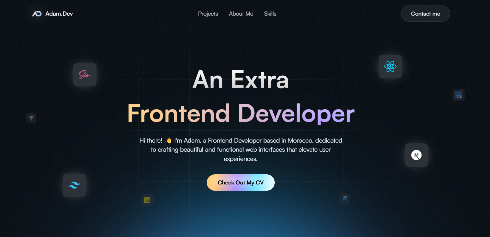

# Adam Jeniah - Full Stack Developer Portfolio

🚀 **Professional Portfolio Website** | [Live Demo](https://adam-dev-portfolio.vercel.app/)



Welcome to my personal portfolio website showcasing my expertise as a **Full Stack Developer** specializing in modern web technologies including React, Next.js, TypeScript, Laravel, and more.

## 🧑‍💻 About Adam Jeniah

I'm **Adam Jeniah**, a passionate **Full Stack Developer** with extensive experience in building scalable web applications and user-friendly interfaces. I specialize in:

- **Frontend**: React, Next.js, TypeScript, JavaScript, Tailwind CSS, Sass, Bootstrap
- **Backend**: Node.js, Express.js, Laravel, Next.js API Routes
- **Databases**: MongoDB, MySQL, PostgreSQL, Supabase, Strapi
- **DevOps**: Docker, AWS, Vercel, Netlify, GitHub Actions, CI/CD, Linux, Nginx
- **Tools**: Git, GitHub, GitLab, Figma, Vite, Prisma ORM

## 🌟 Featured Projects

### 🏢 E-Inventory Management System
A comprehensive SaaS inventory management platform with real-time analytics and multi-tenant architecture.
- **Tech Stack**: TypeScript, React, Next.js, Tailwind CSS, Shadcn/ui, Redux Toolkit
- **Live Demo**: [e-inventory.tech](https://e-inventory.tech/)

### 🔗 DevLinks - Link Sharing Platform
Customizable link-sharing platform for professionals to manage and share their profiles.
- **Tech Stack**: TypeScript, React, Next.js, Strapi, Tailwind CSS
- **Features**: Authentication, Real-time updates, Responsive design

### 🎵 Audiophile E-commerce
Modern e-commerce website for audio equipment with immersive user experience.
- **Tech Stack**: React, Vite, Tailwind CSS, Framer Motion

## 🛠️ Technologies & Skills

### Frontend Development


### Backend Development


### Databases


### DevOps & Deployment


## 📊 GitHub Stats


## 🤝 Connect With Me

- **Portfolio**: [adam-dev-portfolio.vercel.app](https://adam-dev-portfolio.vercel.app/)
- **LinkedIn**: [linkedin.com/in/adam-jeniah](https://www.linkedin.com/in/adam-jeniah/)
- **GitHub**: [github.com/devllopeadam](https://github.com/devllopeadam)
- **Email**: [jeniahadam@gmail.com](mailto:jeniahadam@gmail.com)
- **Phone**: +212 695 26-64-08

## Features 🎉

- **Built with React**: Leveraging React's power for a performant and scalable architecture.
- **Framer Motion for Animations**: Creating engaging animations and transitions.
- **Vite for Speed**: Enjoying fast development and build processes.
- **Tailwind CSS Utility-First Approach**: Rapid styling and streamlined development workflow.
- **Responsive Design**: Ensuring optimal viewing across various devices.
- **SEO Optimized**: Complete meta tags, structured data, and sitemap for better search visibility.

## 🚀 Getting Started

### Prerequisites
- Node.js (v18 or higher)
- npm or yarn

### Installation

1. Clone the repository
```bash
git clone https://github.com/devllopeadam/portfolio-app-master.git
```

2. Navigate to project directory
```bash
cd portfolio-app-master
```

3. Install dependencies
```bash
npm install
```

4. Start development server
```bash
npm run dev
```

5. Open [http://localhost:5173](http://localhost:5173) in your browser

### Building for Production

```bash
npm run build
```

## 📁 Project Structure

```
portfolio-app-master/
├── public/
│   ├── sitemap.xml
│   ├── robots.txt
│   └── assets/
├── src/
│   ├── components/
│   ├── constants/
│   ├── assets/
│   └── styles/
├── package.json
└── README.md
```

## 💡 Hire Me

I'm available for freelance projects and full-time opportunities. If you're looking for a skilled **Full Stack Developer** who can deliver high-quality web applications, let's connect!

**Specializations:**
- ✅ React & Next.js Development
- ✅ TypeScript & JavaScript
- ✅ Laravel & PHP Development
- ✅ Database Design & Management
- ✅ API Development & Integration
- ✅ DevOps & Deployment
- ✅ UI/UX Implementation

---

**Keywords**: Adam Jeniah, Full Stack Developer, React Developer, Next.js Developer, TypeScript Expert, Laravel Developer, Frontend Developer, Backend Developer, Web Developer, JavaScript Expert, Morocco Developer, Freelance Developer, Portfolio Website
